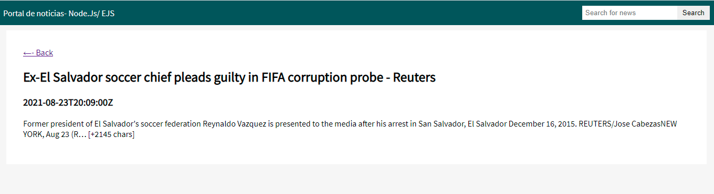

# Sitio de noticias con Node.js, Express, EJS, axios, dotenv - Consumiendo Rest API

## Installation
Para ejecutar la app. Primero instalar las siguientes dependencias npm:

```
$ npm install
$ npm run dev
```

### Crear archivo .env
Crear archivo .env para guardar la key del api
```
API_KEY = aquielcodigosecretodelapikey
```

### Modulos
1-express<br>
2-ejs<br>
3-axios<br>
4-body-parser<br>
5-dotenv<br>
5-api rest externa https://newsapi.org/docs<br>





